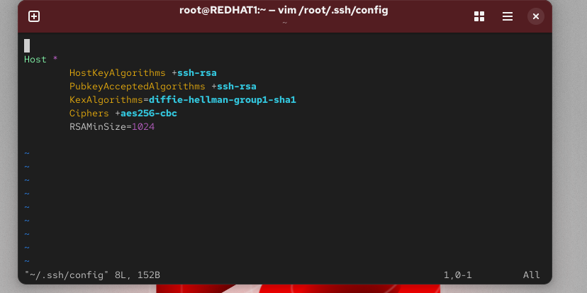
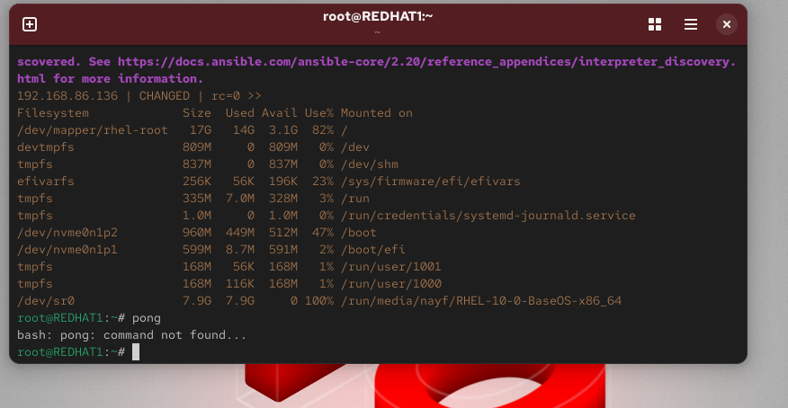
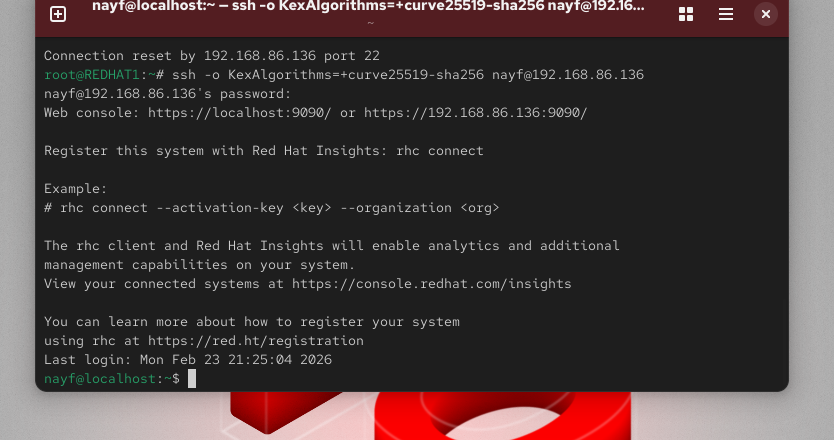

🚀 Lab 26 — Ansible Initial Configuration and Ad-Hoc Execution
🟢 Project Description

This lab demonstrates the initial configuration of Ansible Automation Platform, including:

Installing Ansible Core

Configuring SSH passwordless authentication

Creating inventory files

Executing Ad-hoc commands on remote nodes

The goal is to automate system management and remote execution tasks using Ansible.

🟢 Architecture
Control Node (REDHAT1)
        ↓
SSH Connection + Ansible Automation
        ↓
Managed Node (Remote Server)
🟢 Prerequisites

Before starting, make sure you have:

2 Virtual Machines or Servers

Linux Operating System (RHEL Recommended)

Root or sudo access

Network connectivity between nodes

🟢 Installation Steps
✅ Install Ansible Core on Control Node
sudo dnf install ansible-core -y

Check version:

ansible --version
🟢 Configure SSH Key Authentication
Generate SSH Key
ssh-keygen

Keep default values and press Enter.

Copy Key to Managed Node
ssh-copy-id username@MANAGED_NODE_IP

Example:

ssh-copy-id nayf@192.168.86.136

Test connection:

ssh username@MANAGED_NODE_IP
🟢 Create Inventory File

Create inventory file:

nano inventory.ini

Add:

[myservers]
192.168.86.136 ansible_user=nayf ansible_ssh_private_key_file=/root/.ssh/id_ed25519
🟢 Test Connection Using Ansible
Ping Test
ansible -i inventory.ini myservers -m ping

Expected Output:

pong
🟢 Execute Ad-hoc Commands
Check Disk Space
ansible -i inventory.ini myservers -a "df -h" --become
Reboot Remote Server
ansible -i inventory.ini myservers -m reboot --become
🟢 Troubleshooting
SSH Issues

Check SSH service status

systemctl status sshd
Inventory Parsing Errors

Verify inventory file path and syntax.

🟢 Conclusion

This lab demonstrated how to:

Configure Ansible automation

Enable SSH passwordless login

Manage remote servers using Ad-hoc commands
