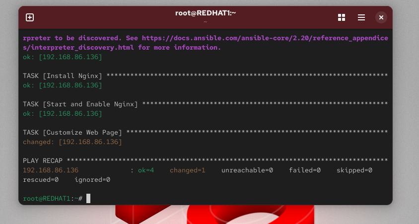
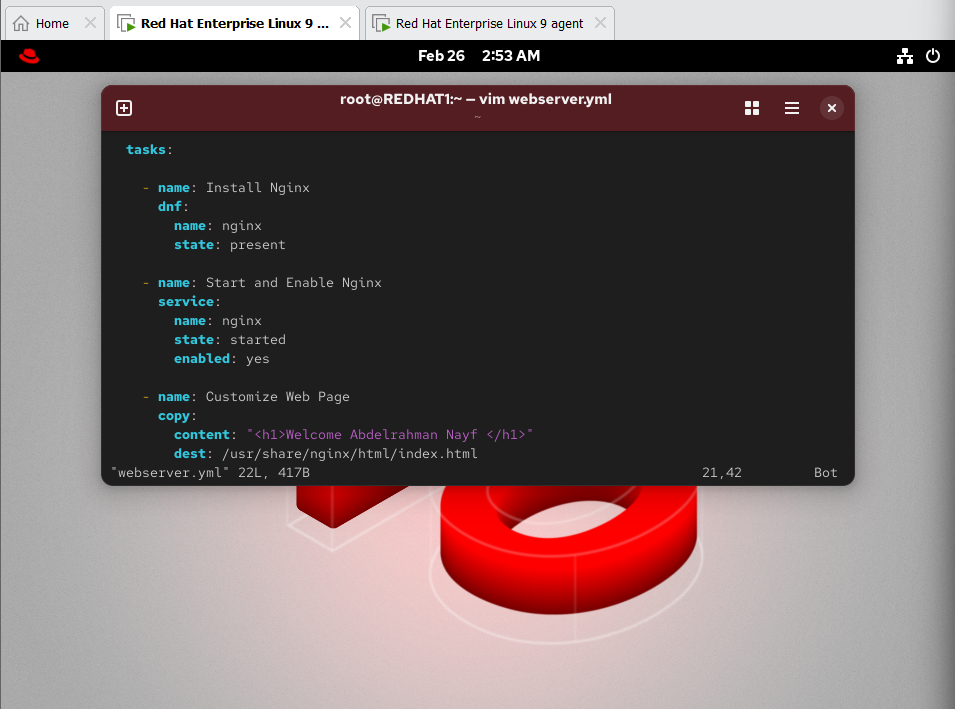
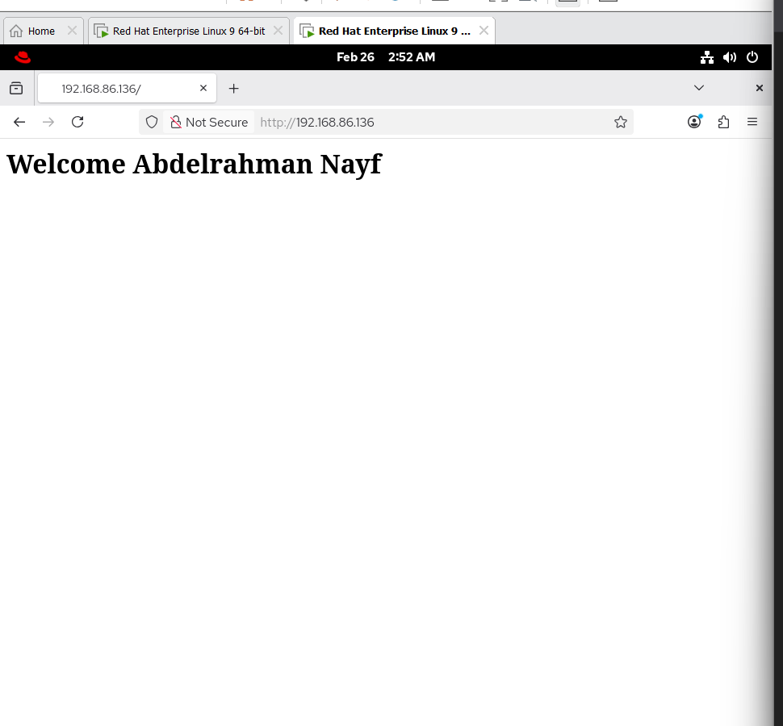

🚀 Lab 27 — Automated Web Server Configuration Using Ansible
📌 Overview

This lab demonstrates how to automate web server configuration using Ansible Playbooks.

🎯 Objectives

Install Nginx on managed node

Start and enable Nginx service

Customize the default web page

Verify the configuration

🖥 Lab Environment
Role	Description
Control Node	REDHAT1 (Ansible Installed)
Managed Node	192.168.86.136
Web Server	Nginx
🟢 Step 1 — Test Connection
ansible -i inventory.ini myservers -m ping

Expected output:

pong
🟢 Step 2 — Create Playbook
nano webserver.yml
📄 webserver.yml
---
- name: Configure Web Server
  hosts: myservers
  become: yes

  tasks:

    - name: Install Nginx
      dnf:
        name: nginx
        state: present

    - name: Start and Enable Nginx
      service:
        name: nginx
        state: started
        enabled: yes

    - name: Customize Web Page
      copy:
        content: "<h1>Welcome Abdelrahman Nayf </h1>"
        dest: /usr/share/nginx/html/index.html
🟢 Step 3 — Run Playbook
ansible-playbook -i inventory.ini webserver.yml --ask-become-pass

If successful:

changed=3
failed=0
🟢 Step 4 — Verify Service
Check service status:
ansible -i inventory.ini myservers -a "systemctl status nginx" --become

Expected:

active (running)
Test from browser:
http://192.168.86.136

You should see:

Welcome Abdelrahman Nayf 
Verify using curl:
ansible -i inventory.ini myservers -a "curl localhost"
🟢 Key Concepts
Concept	Description
Playbook	YAML file containing automation tasks
become: yes	Run tasks with sudo
Idempotent	Tasks run only if changes are needed
Inventory	List of managed hosts
🏁 Conclusion

In this lab, we successfully:

Automated Nginx installation

Configured and enabled the service

Customized the web page

Verified the deployment
