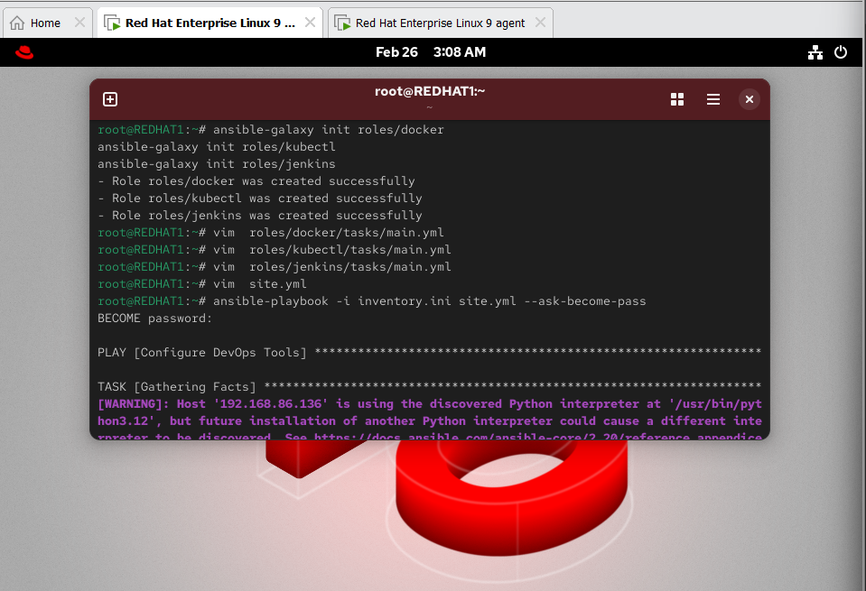
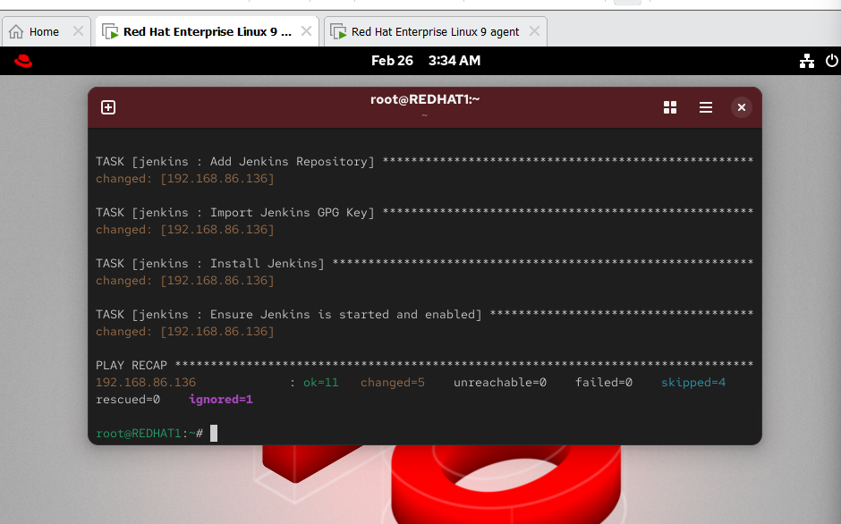

🚀 Lab 28 — Structured Configuration Management Using Ansible Roles
📌 Overview

This lab demonstrates structured configuration management using Ansible Roles to automate the installation of DevOps tools.

The following tools were configured:

Docker

kubectl

Jenkins

🎯 Objectives

Create Ansible roles

Automate software installation

Use conditional tasks for smart automation

Verify installations on managed nodes

🖥 Lab Architecture
Control Node (REDHAT1)
        ↓ SSH + Ansible Automation
Managed Node (192.168.86.136)
🟢 Prerequisites

2 Virtual Machines

Linux OS (RHEL Recommended)

SSH passwordless authentication

Ansible Core installed

🟢 Install Ansible
sudo dnf install ansible-core -y

Check version:

ansible --version
🟢 Create Inventory File
nano inventory.ini

Example:

[myservers]
192.168.86.136 ansible_user=nayf

Test connection:

ansible -i inventory.ini myservers -m ping

Expected Output:

pong
🟢 Create Roles Structure
ansible-galaxy init roles/docker
ansible-galaxy init roles/kubectl
ansible-galaxy init roles/jenkins

Roles structure:

roles/
 ├── docker/
 ├── kubectl/
 └── jenkins/
🟢 Docker Role

Install Docker CE:

- name: Install Docker
  dnf:
    name:
      - docker-ce
      - docker-ce-cli
      - containerd.io
    state: present

- name: Start Docker
  service:
    name: docker
    state: started
    enabled: yes
🟢 Kubectl Role

Add Kubernetes repository:

- name: Add Kubernetes Repo
  copy:
    dest: /etc/yum.repos.d/kubernetes.repo
    content: |
      [kubernetes]
      name=Kubernetes
      baseurl=https://pkgs.k8s.io/core:/stable:/v1.29/rpm/
      enabled=1
      gpgcheck=1

- name: Install kubectl
  dnf:
    name: kubectl
    state: present
🟢 Jenkins Role

Install Jenkins prerequisites:

- name: Install Java
  dnf:
    name: java-11-openjdk
    state: present

Add Jenkins repo:

- name: Add Jenkins Repo
  get_url:
    url: https://pkg.jenkins.io/redhat-stable/jenkins.repo
    dest: /etc/yum.repos.d/jenkins.repo

Install and start Jenkins:

- name: Install Jenkins
  dnf:
    name: jenkins
    state: present

- name: Start Jenkins
  service:
    name: jenkins
    state: started
    enabled: yes
🟢 Create Main Playbook
nano site.yml
---
- name: Configure DevOps Tools
  hosts: myservers
  become: yes

  roles:
    - docker
    - kubectl
    - jenkins
🟢 Run Playbook
ansible-playbook -i inventory.ini site.yml --ask-become-pass
🟢 Verification Commands

Check Docker:

docker --version

Check kubectl:

kubectl version --client

Check Jenkins:

systemctl status jenkins

Open Jenkins UI:

http://MANAGED_NODE_IP:8080
🟢 Key Concepts Learned

✅ Ansible Roles Structure
✅ Infrastructure Automation
✅ Conditional Task Execution
✅ DevOps Tool Deployment

