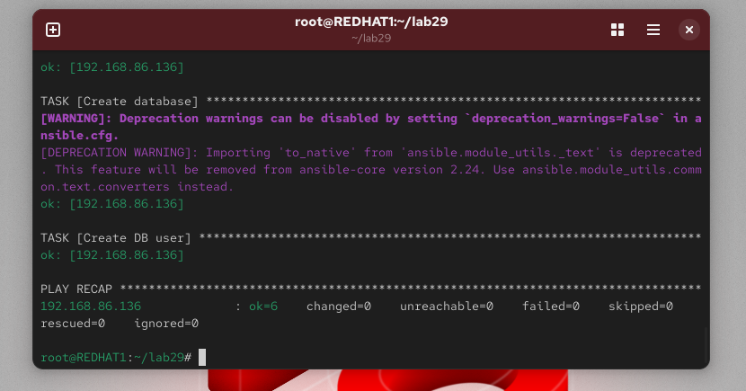

# 🔐 Lab 29: Securing Sensitive Data with Ansible Vault


---

## 📌 Overview

This lab demonstrates how to automate database provisioning using **Ansible** while securely managing sensitive data using **Ansible Vault**.

The automation playbook installs a database server, creates a database, and configures a user with privileges while keeping credentials encrypted.

---

## 🎯 Objectives

* Automate database server installation
* Create a database named **iVolve**
* Create a database user with full privileges
* Secure sensitive data using **Ansible Vault**
* Validate database access from the managed node

---

## 🏗️ Architecture

```
+------------------------+
|  Ansible Control Node  |
|       REDHAT1          |
+-----------+------------+
            |
            | SSH
            |
+-----------v------------+
|      Managed Node      |
|    192.168.86.136      |
|                        |
|     MariaDB Server     |
|                        |
|  Database: iVolve      |
|  User: ivolve_user     |
+------------------------+
```

---

## 📂 Project Structure

```
lab29
│
├── inventory
├── playbook.yml
├── vars.yml (encrypted)
└── README.md
```

---

## ⚙️ Inventory Configuration

```
[db]
192.168.86.136 ansible_user=nayf
```

---

## 🔒 Securing Variables with Ansible Vault

Sensitive data such as the database password is stored in a variables file.

Example variables file:

```yaml
db_name: iVolve
db_user: ivolve_user
db_password: StrongPassword
```

Encrypt the file:

```bash
ansible-vault encrypt vars.yml
```

After encryption, the file content will look like:

```
$ANSIBLE_VAULT;1.1;AES256
623735373863623861356336656632613763...
```

---

## 📜 Ansible Playbook

```yaml
- name: Install MariaDB and Configure Database
  hosts: db
  become: yes
  vars_files:
    - vars.yml

  tasks:

  - name: Install MariaDB Server
    dnf:
      name: mariadb-server
      state: present

  - name: Install MySQL Python Library
    dnf:
      name: python3-PyMySQL
      state: present

  - name: Start MariaDB Service
    service:
      name: mariadb
      state: started
      enabled: yes

  - name: Create Database
    mysql_db:
      name: "{{ db_name }}"
      state: present

  - name: Create Database User
    mysql_user:
      name: "{{ db_user }}"
      password: "{{ db_password }}"
      priv: "{{ db_name }}.*:ALL"
      host: "%"
      state: present
```

---

## ▶️ Running the Playbook

Execute the playbook from the control node:

```bash
ansible-playbook -i inventory playbook.yml --ask-vault-pass --ask-become-pass
```

You will be prompted for:

* Vault password
* Sudo password

---

## ✅ Validation

Connect to the managed node and verify the database.

```
mysql -u ivolve_user -p
```

Then run:

```
show databases;
```

Expected output:

```
+--------------------+
| Database           |
+--------------------+
| iVolve             |
| information_schema |
| mysql              |
+--------------------+
```

---

## 🧠 Key Concepts Learned

* Infrastructure automation using **Ansible**
* Protecting secrets using **Ansible Vault**
* Database provisioning via automation
* Secure DevOps practices

---

## 🚀 Conclusion

This lab demonstrates how automation and security can work together in modern DevOps workflows.
Using **Ansible Vault**, sensitive credentials such as database passwords can be securely encrypted while still being used in automated deployments.

---
