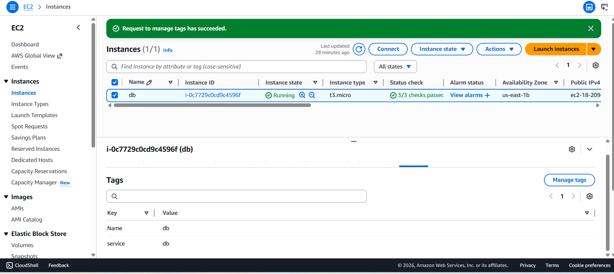

# 🚀 Lab 30 – Automated Host Discovery with Ansible Dynamic Inventory

## 📌 Overview

This lab demonstrates how to use **Ansible Dynamic Inventory** to automatically discover and manage AWS EC2 instances.

Instead of manually specifying servers in a static inventory file, Ansible dynamically queries AWS to retrieve running instances based on specific **tags**.

In this lab, we also deploy **MySQL** on the discovered EC2 instance using an Ansible Role.

---

## 🎯 Objectives

* Launch an EC2 instance in AWS
* Tag the instance with `service=db`
* Configure **Ansible Dynamic Inventory**
* Automatically discover EC2 instances
* Verify discovered hosts using Ansible commands
* Deploy MySQL using an Ansible Role

---

## 🏗 Architecture

Ansible dynamically communicates with AWS using the **AWS EC2 Inventory Plugin**.

```
Ansible Controller
        │
        │ AWS
```

