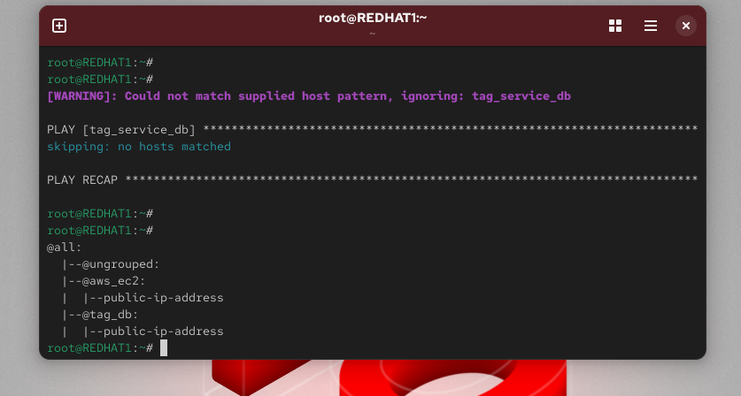

# 🚀 Lab 30 – Automated Host Discovery with Ansible Dynamic Inventory

## 📌 Overview

This lab demonstrates how to use **Ansible Dynamic Inventory** to automatically discover and manage AWS EC2 instances.

Instead of manually specifying servers in a static inventory file, Ansible dynamically queries AWS to retrieve running instances based on specific **tags**.

In this lab, we also deploy **MySQL** on the discovered EC2 instance using an Ansible Role.

---

## 🎯 Objectives

* Launch an EC2 instance in AWS
* Tag the instance with `service=db`
* Configure **Ansible Dynamic Inventory**
* Automatically discover EC2 instances
* Verify discovered hosts using Ansible commands
* Deploy MySQL using an Ansible Role

---

## 🏗 Architecture

Ansible dynamically communicates with AWS using the **AWS EC2 Inventory Plugin**.

```
Ansible Controller
        │
        │ AWS API
        ▼
AWS EC2 Instances (tag: service=db)
        │
        ▼
Run MySQL Role
```

---

## ⚙️ Prerequisites

* AWS Account / AWS Academy Lab
* Linux server with Ansible installed
* AWS CLI installed
* Python libraries for AWS integration

Install required libraries:

```bash
pip install boto boto3
```

---

# 🧪 Lab Steps

---

# 1️⃣ Launch EC2 Instance

Go to **AWS Console → EC2 → Launch Instance**

Configuration:

* Instance Name: `db`
* Instance Type: `t3.micro`
* Region: `us-east-1`

Add the following tags:

| Key     | Value |
| ------- | ----- |
| Name    | db    |
| service | db    |

This tag allows Ansible to automatically discover the instance.

---

# 2️⃣ Configure AWS CLI

Configure AWS credentials on the Ansible controller:

```bash
aws configure
```

Example configuration:

```
AWS Access Key ID: ********
AWS Secret Access Key: ********
Default region name: us-east-1
Default output format: json
```

---

# 3️⃣ Create Dynamic Inventory File

Create the inventory configuration file:

```bash
vim aws_ec2.yml
```

Add the following configuration:

```yaml
plugin: amazon.aws.aws_ec2

regions:
  - us-east-1

filters:
  tag:service: db

keyed_groups:
  - key: tags.service
    prefix: tag

hostnames:
  - public-ip-address
```

---

# 4️⃣ Verify Inventory

List discovered EC2 instances:

```bash
ansible-inventory -i aws_ec2.yml --list
```

Or display inventory graph:

```bash
ansible-inventory -i aws_ec2.yml --graph
```

Expected output:

```
@tag_service_db
 └── ec2-instance
```

---

# 5️⃣ Create MySQL Role

Generate the role structure:

```bash
ansible-galaxy init mysql
```

Edit tasks file:

```bash
vim mysql/tasks/main.yml
```

Add task:

```yaml
- name: Install MySQL Server
  apt:
    name: mysql-server
    state: present
    update_cache: yes
```

---

# 6️⃣ Create Playbook

Create the playbook:

```bash
vim install-mysql.yml
```

Add the following content:

```yaml
- hosts: tag_service_db
  become: yes

  roles:
    - mysql
```

---

# 7️⃣ Run the Playbook

Execute the playbook:

```bash
ansible-playbook -i aws_ec2.yml install-mysql.yml
```

Ansible will:

1. Query AWS for EC2 instances
2. Discover instances with `service=db` tag
3. Connect via SSH
4. Install MySQL automatically

---

# ✅ Verification

Login to the EC2 instance and verify MySQL installation:

```bash
mysql --version
```

---

# 📚 Key Concepts Learned

* Ansible Dynamic Inventory
* AWS EC2 automation
* Infrastructure discovery using tags
* Role-based configuration management
* DevOps automation practices

---

# 🏁 Conclusion

This lab demonstrates how **Ansible can dynamically discover cloud infrastructure** and automate configuration management without maintaining static inventories.

Dynamic inventory is widely used in modern **DevOps and cloud automation workflows**.

---

# 👨‍💻 Author

**Abdelrahman Nayf**

DevOps Engineer in Training


