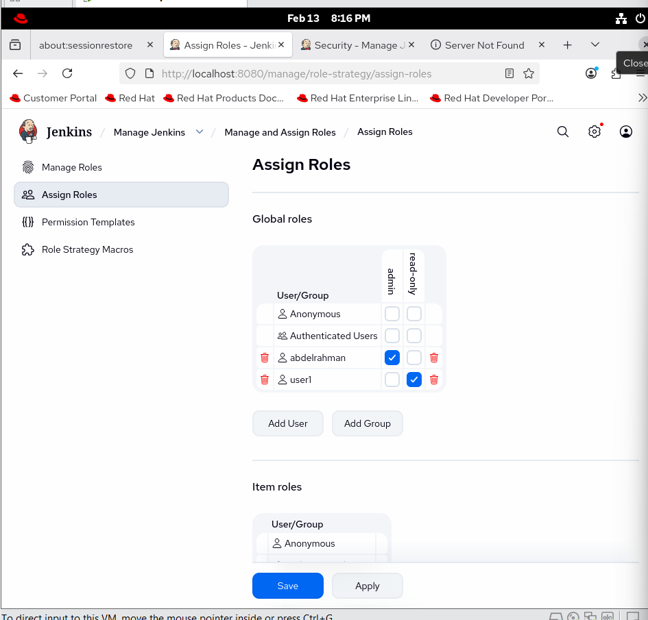

Step 1: Plugin Installation
From the Jenkins Dashboard, navigate to Manage Jenkins.

Select Plugins, then search for the "Role-based Authorization Strategy" plugin.

Click Install without restart.

Step 2: Enable Role-Based Strategy
Go to Manage Jenkins -> Configure Global Security.

Locate the Authorization section.

Change the selection to Role-Based Strategy.

Click Save.

Step 3: Create Roles (Manage Roles)
Navigate to the newly appeared option: Manage and Assign Roles.

Select Manage Roles to define different access levels (e.g., admin and read-only).

Under Global roles, add a role named read-only and grant it the Overall: Read permission.

Step 4: Assign Roles to Users
(As demonstrated in the laboratory screenshots)

Select Assign Roles.

Add the required users (e.g., abdelrahman and user1).

Assign the admin role to the primary user and the read-only role to other users.
