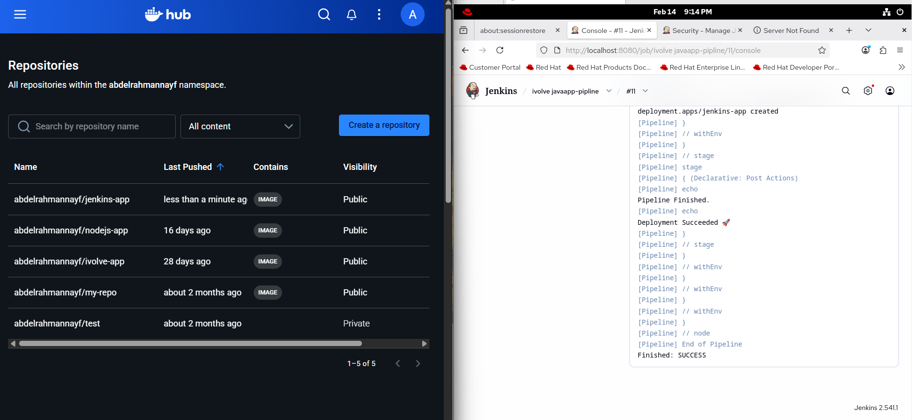
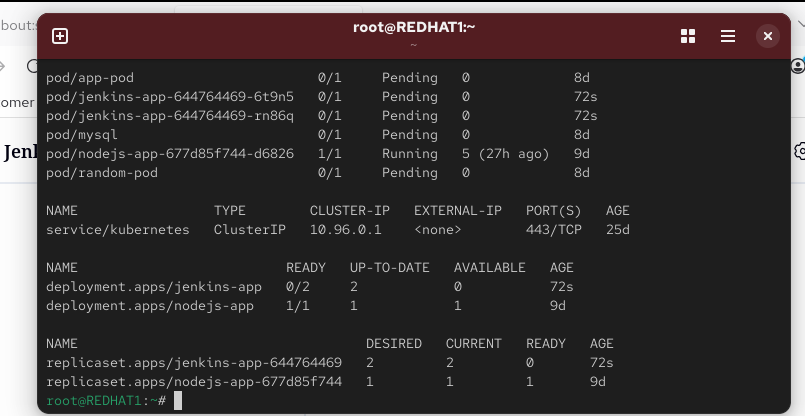
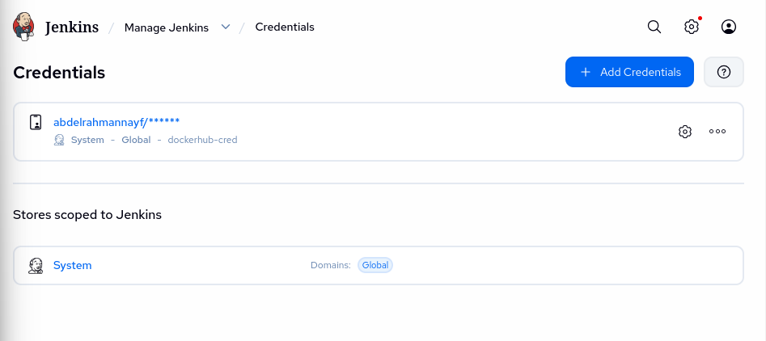

🚀 Java Application CI/CD Pipeline (Lab 22)
An automated CI/CD pipeline for a Java Spring Boot application, built and deployed using industry-standard DevOps tools.

🛠 Tech Stack
Java & Maven: For application development and unit testing.

Jenkins: Orchestrating the entire CI/CD pipeline.

Docker: Containerizing the application into lightweight images.

Docker Hub: Acting as a central registry for versioned images.

Kubernetes (Kind): The target environment for deploying and managing the application.

🛣 Pipeline Stages
The Jenkinsfile defines the following automated stages:

Run Unit Test: Validates the source code using mvn test.

Build App: Compiles and packages the code into an executable .jar file using mvn package.

Build Docker Image: Creates a Docker image tagged with the specific Jenkins Build Number.

Push Docker Image: Uploads the newly created image to the Docker Hub repository.

Deploy to Kubernetes: Updates the deployment.yaml and applies the changes to the cluster using kubectl apply.

⚙️ Configuration & Setup
1. Permissions
To ensure Jenkins can interact with Docker and Kubernetes, the following permissions were configured:

Bash
sudo usermod -aG docker jenkins
sudo chown -R jenkins:jenkins /var/lib/jenkins/.kube
sudo systemctl restart jenkins
2. Environment Variables
The following variables must be set in the Jenkinsfile:

DOCKER_IMAGE: Your Docker Hub repository (e.g., username/app-name).

DEPLOYMENT_FILE: The path to your Kubernetes manifest (e.g., deployment.yaml).

📊 Final Results
✅ Success: Fully automated "Green" pipeline in Jenkins.

✅ Version Control: Numbered image tags successfully pushed to Docker Hub.

✅ Live Deployment: Application is up and running on the Kubernetes cluster.
