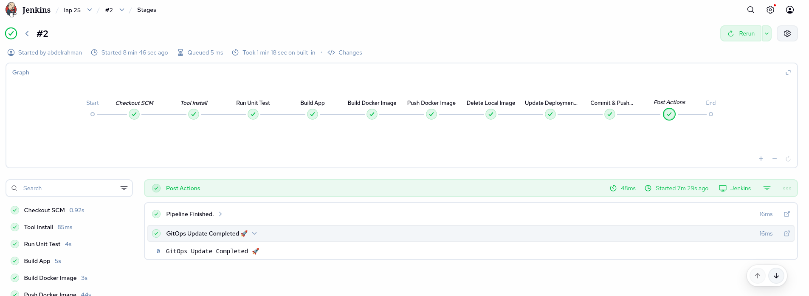
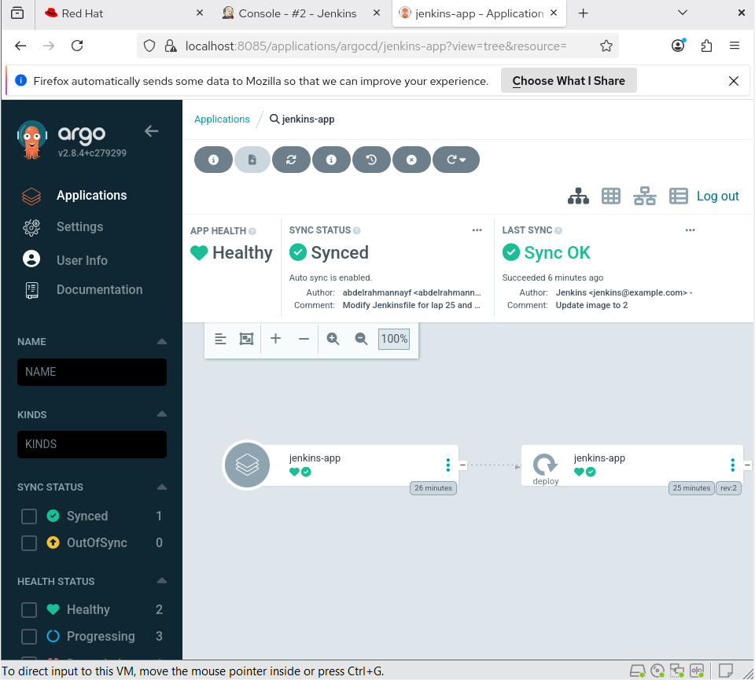

Jenkins & ArgoCD GitOps Pipeline and cred (Lab 25)
📝 Project Overview / ملخص المشروع
This project demonstrates a full GitOps CI/CD pipeline using Jenkins for Continuous Integration and ArgoCD for Continuous Delivery on Kubernetes.
هذا المشروع يوضح دورة كاملة لـ GitOps CI/CD باستخدام Jenkins للتكامل المستمر و ArgoCD للتسليم المستمر على بيئة Kubernetes.

🚀 Pipeline Stages / مراحل العمل
Unit Testing: Running Maven tests to ensure code quality.

اختبار الكود: تشغيل اختبارات Maven للتأكد من جودة الكود.

Build App: Packaging the Spring Boot application into a JAR file.

بناء التطبيق: تحويل الكود لملف JAR قابل للتشغيل.

Dockerize: Building a Docker image and tagging it with the Jenkins build number.

صناعة الصورة: بناء Docker Image وتسميتها برقم الـ Build الحالي.

Push Image: Uploading the image to Docker Hub.

رفع الصورة: رفع الـ Image إلى Docker Hub.

Update Manifest: Using sed to update the image tag in deployment.yaml.

تحديث ملفات الإعداد: تحديث رقم الـ Image في ملف الـ Deployment داخل GitHub.

GitOps Sync: ArgoCD detects changes in GitHub and syncs them to the Kubernetes Cluster.

مزامنة ArgoCD: يقوم ArgoCD باكتشاف التغييرات وتطبيقها تلقائياً على الكلاستر.

🛠 Challenges & Solutions / التحديات والحلول
1. File Paths with Spaces / مشكلة المسافات في المسارات
Problem: The pipeline failed during git add because the folder name lap 25 contained a space, causing Git to misinterpret the path.

المشكلة: فشل الـ Pipeline عند خطوة git add لأن اسم الفولدر يحتوي على مسافة، مما جعل Git يقرأ المسار بشكل خاطئ.

Solution: Wrap all file path variables in double quotes "${DEPLOYMENT_FILE}" to ensure the shell reads them as a single string.

الحل: وضع جميع متغيرات المسارات بين علامات تنصيص "" لضمان قراءتها كمسار واحد صحيح.

2. ArgoCD "Degraded" State / حالة التطبيق المتدهورة
Problem: The application was in a Degraded state because of failed syncs or incorrect image tags.

المشكلة: كان التطبيق في حالة Degraded بسبب فشل التحديثات السابقة أو وجود خطأ في ملفات الإعداد.

Solution: Once the Jenkins pipeline successfully pushed the correct image tag and manifest, ArgoCD transitioned to Healthy.

الحل: بمجرد نجاح الـ Pipeline في تحديث البيانات بشكل صحيح، تحولت حالة التطبيق في ArgoCD إلى Healthy (قلب أخضر).

🏗 Technology Stack / الأدوات المستخدمة
CI Tool: Jenkins

CD Tool: ArgoCD (GitOps)

Build Tool: Maven

Containerization: Docker

Orchestration: Kubernetes

Version Control: GitHub

Final Status / الحالة النهائية
Jenkins Build: Success ✅

ArgoCD Health: Healthy 💚

Sync Status: Synced ✅  

🔑 Credentials Setup / إعدادات الحماية والوصول
To run this pipeline, the following credentials must be configured in Jenkins (Manage Jenkins > Credentials):
لعمل هذا الـ Pipeline بنجاح، يجب إعداد الحسابات التالية داخل Jenkins:

github-cred:

Type: Username with password (Personal Access Token).

Purpose: To allow Jenkins to push changes to your GitHub repository.

الهدف: السماح لـ Jenkins برفع التعديلات (Push) إلى مستودع GitHub الخاص بك.

dockerhub-cred:

Type: Username with password.

Purpose: To authenticate with Docker Hub for pushing the application image.

الهدف: تسجيل الدخول إلى Docker Hub لرفع صورة التطبيق (Image).
