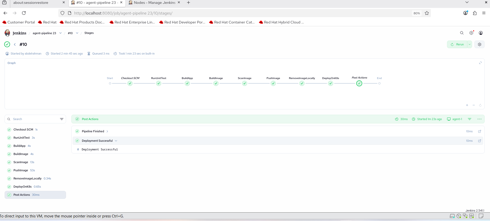
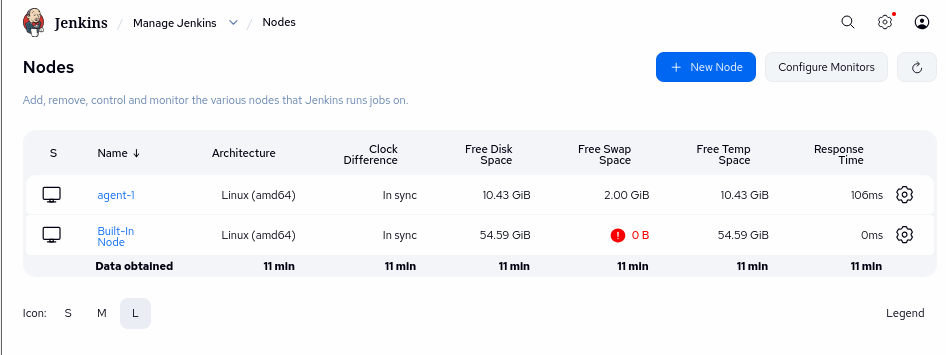
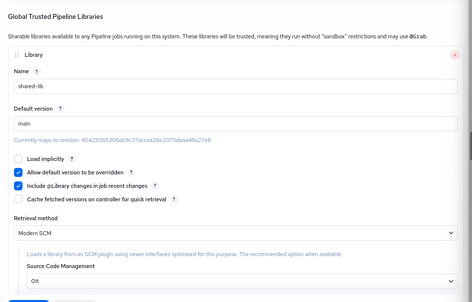

# Jenkins CI/CD Pipeline - Lab 23

## وصف المشروع
هذا المشروع يوضح كيفية إنشاء **CI/CD Pipeline** باستخدام **Jenkins Agents** و **Shared Library** لتطبيق Java مع Docker و Kubernetes.

---

## هيكل المشروع
- `CI-CD/lap23/`
  - `Dockerfile` → لبناء صورة Docker للتطبيق
  - `pom.xml` → مشروع Maven
  - `src/` → كود Java
  - `deployment.yaml` → تعريف Kubernetes Deployment وService

- `shared-lib/vars/` → مكتبة مشتركة مع الفانكشنز:
  - `runUnitTest.groovy`
  - `buildApp.groovy`
  - `buildImage.groovy`
  - `scanImage.groovy`
  - `pushImage.groovy`
  - `deployOnK8s.groovy`

---

## مراحل الـ Pipeline
1. **RunUnitTest** → تشغيل اختبارات الوحدة (Unit Tests)
2. **BuildApp** → بناء التطبيق (JAR) بدون اختبارات
3. **BuildImage** → بناء صورة Docker
4. **ScanImage** → فحص الثغرات باستخدام Trivy
5. **PushImage** → رفع الصورة لـ Docker Hub
6. **RemoveImageLocally** → حذف الصورة محليًا
7. **DeployOnK8s** → نشر التطبيق على Kubernetes Cluster
8. **Post Actions** → رسائل انتهاء البايبلاين

---

## إعداد Jenkins Agent
- Agent مسمى: `agent-1`
- مثبت عليه: Java, Maven, Docker, kubectl, Trivy
- مرتبط بالبايبلاين من خلال `agent { label 'agent-1' }`

---

## ملاحظات
- تأكد أن Shared Library تتوافق مع المتغيرات (`DOCKER_IMAGE` و `TAG`) قبل الاستدعاء.
- في مرحلة Trivy، استخدم `--timeout 10m` لتجنب فشل الـ scan بسبب تحميل قاعدة البيانات Java DB.
- الـ `deployment.yaml` يستخدم لتحديث الصورة في Kubernetes مع كل Build.

---

## تشغيل البايبلاين
1. افتح Jenkins → اختر المشروع `agent-pipeline 23`
2. اضغط **Build Now**
3. راقب الستيجز للتأكد من نجاح كل مرحلة
4. بعد انتهاء البايبلاين، التطبيق يصبح متاح على الـ Kubernetes Namespace المحدد.

---

