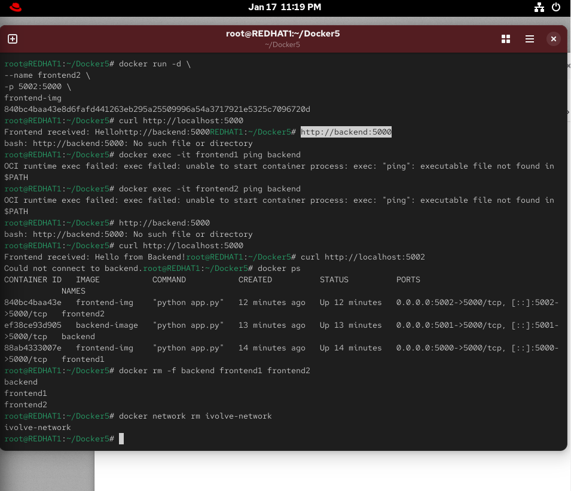

# 1) Clone المشروع
git clone https://github.com/Ibrahim-Adel15/Docker5.git
cd Docker5

# 2) Build backend image
cd backend
docker build -t backend-image .
cd ..

# 3) Build frontend image
cd frontend
docker build -t frontend-img .
cd ..

# 4) Create custom network
docker network create ivolve-network

# 5) Run backend container on custom network
docker run -d \
--name backend \
--network ivolve-network \
-p 5001:5000 \
backend-image

# 6) Run frontend1 on the same custom network
docker run -d \
--name frontend1 \
--network ivolve-network \
-p 5000:5000 \
frontend-img

# 7) Run frontend2 on default network
docker run -d \
--name frontend2 \
-p 5002:5000 \
frontend-img

# 8) Verify frontend1 (should work)
curl http://localhost:5000

# 9) Verify frontend2 (should fail or error)
curl http://localhost:5002

# 10) Show running containers
docker ps

# 11) Cleanup containers
docker rm -f backend frontend1 frontend2

# 12) Delete custom network
docker network rm ivolve-network 

