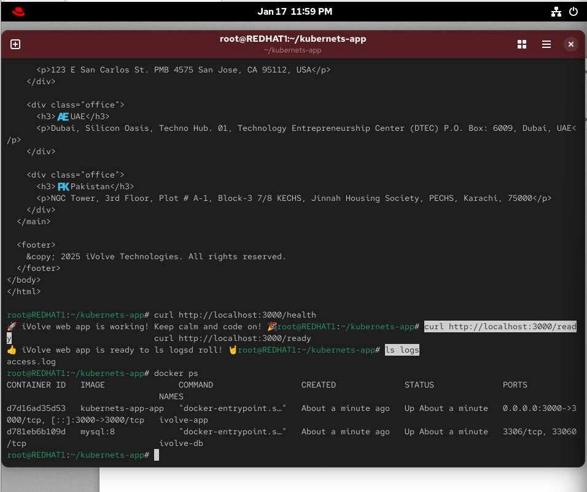

# 1️⃣ Clone 
git clone https://github.com/Ibrahim-Adel15/kubernets-app.git
cd kubernets-app

# 2️⃣ إنشاء docker-compose.yml
cat <<EOF > docker-compose.yml
version: "3.8"

services:
  db:
    image: mysql:8.0
    container_name: mysql_db
    environment:
      MYSQL_ROOT_PASSWORD: root
      MYSQL_DATABASE: ivolve
    volumes:
      - db_data:/var/lib/mysql
    ports:
      - "3306:3306"

  app:
    build: .
    container_name: node_app
    ports:
      - "3000:3000"
    environment:
      DB_HOST: db
      DB_USER: root
      DB_PASSWORD: root
    depends_on:
      - db

volumes:
  db_data:
EOF

# 3️⃣ تشغيل الـ stack
docker compose up -d --build

# 4️⃣ التأكد إن الكونتينرز شغالة
docker compose ps

# 5️⃣ التحقق إن التطبيق شغال
curl http://localhost:3000

# 6️⃣ Verify /health
curl http://localhost:3000/health

# 7️⃣ Verify /ready
curl http://localhost:3000/ready

# 8️⃣ Verify access logs
docker exec -it node_app ls /app/logs
docker exec -it node_app cat /app/logs/access.log

# 9️⃣ Build image لوحدها (علشان ال push)
docker build -t YOUR_DOCKERHUB_USERNAME/ivolve-app:latest .

# 🔟 Login DockerHub
docker login

# 1️⃣1️⃣ Push image
docker push YOUR_DOCKERHUB_USERNAME/ivolve-app:latest

