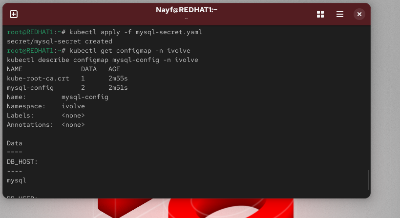

apiVersion: v1
kind: ConfigMap
metadata:
  name: mysql-config
  namespace: ivolve
data:
  DB_HOST: mysql
  DB_USER: ivolve_user

kubectl apply -f mysql-configmap.yaml

echo -n 'mysecretpassword' | base64        # DB_PASSWORD
echo -n 'rootpassword' | base64           # MYSQL_ROOT_PASSWORD
apiVersion: v1
kind: Secret
metadata:
  name: mysql-secret
  namespace: ivolve
type: Opaque
data:
  DB_PASSWORD: bXlzZWNyZXRwYXNzd29yZA==
  MYSQL_ROOT_PASSWORD: cm9vdHBhc3N3b3Jk
kubectl apply -f mysql-secret.yaml

kubectl get configmap -n ivolve
kubectl describe configmap mysql-config -n ivolve

kubectl get secret -n ivolve
kubectl describe secret mysql-secret -n ivolve
