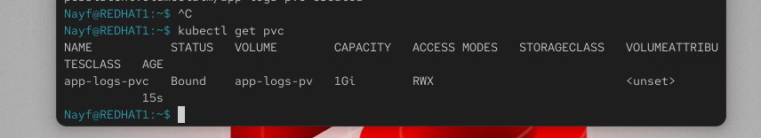

sudo mkdir -p /mnt/app-logs
sudo chmod 777 /mnt/app-logs

apiVersion: v1
kind: PersistentVolume
metadata:
  name: app-logs-pv
spec:
  capacity:
    storage: 1Gi
  accessModes:
    - ReadWriteMany
  persistentVolumeReclaimPolicy: Retain
  storageClassName: ""
  hostPath:
    path: /mnt/app-logs

apiVersion: v1
kind: PersistentVolumeClaim
metadata:
  name: app-logs-pvc
spec:
  accessModes:
    - ReadWriteMany
  resources:
    requests:
      storage: 1Gi
  storageClassName: ""

kubectl apply -f pv.yaml
kubectl apply -f pvc.yaml
kubectl get pv
kubectl get pvc
