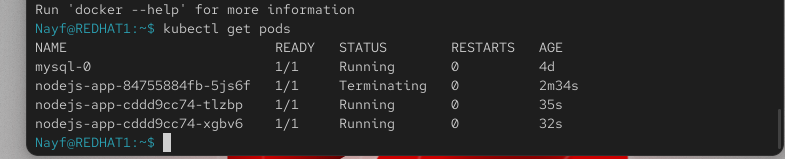

1# 1️⃣ أنشئ PersistentVolumeClaim للبود

kubectl apply -f nodejs-pvc.yaml

# 2️⃣ أنشئ Deployment
cat <<EOF | kubectl apply -f -
apiVersion: apps/v1
kind: Deployment
metadata:
  name: nodejs-app
spec:
  replicas: 2
  selector:
    matchLabels:
      app: nodejs
  template:
    metadata:
      labels:
        app: nodejs
    spec:
      tolerations:
      - key: "node"
        operator: "Equal"
        value: "worker"
        effect: "NoSchedule"
      containers:
      - name: nodejs
        image: abdelrahmannayf/nodejs-app:latest
        imagePullPolicy: Always
        ports:
        - containerPort: 3000
        envFrom:
        - configMapRef:
            name: nodejs-config
        - secretRef:
            name: nodejs-secret
        volumeMounts:
        - name: app-storage
          mountPath: /app/data
      volumes:
      - name: app-storage
        persistentVolumeClaim:
          claimName: nodejs-pvc
EOF

# 3️⃣ أنشئ ClusterIP Service لتوزيع الترافيك
cat <<EOF | kubectl apply -f -
apiVersion: v1
kind: Service
metadata:
  name: nodejs-service
spec:
  selector:
    app: nodejs
  ports:
    - protocol: TCP
      port: 80
      targetPort: 3000
  type: ClusterIP
EOF

# 4️⃣ تحقق من حالة الـ pods و service
kubectl get pods
kubectl get svc
