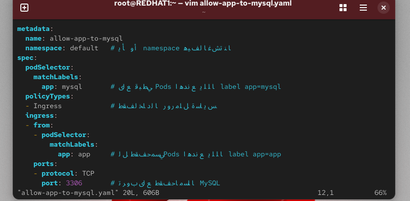

---
# MySQL Pod خفيف للـ Minikube
apiVersion: v1
kind: Pod
metadata:
  name: mysql
  labels:
    app: mysql
spec:
  containers:
  - name: mysql
    image: busybox
    command: ["sleep", "3600"]

---
# Application Pod المسموح له بالوصول
apiVersion: v1
kind: Pod
metadata:
  name: app-pod
  labels:
    app: app
spec:
  containers:
  - name: app
    image: busybox
    command: ["sleep", "3600"]

---
# Random Pod غير المسموح له
apiVersion: v1
kind: Pod
metadata:
  name: random-pod
  labels:
    app: random
spec:
  containers:
  - name: random
    image: busybox
    command: ["sleep", "3600"]

---
# NetworkPolicy لتحديد من يقدر يوصل للـ MySQL
apiVersion: networking.k8s.io/v1
kind: NetworkPolicy
metadata:
  name: allow-app-to-mysql
spec:
  podSelector:
    matchLabels:
      app: mysql
  policyTypes:
  - Ingress
  ingress:
  - from:
      - podSelector:
          matchLabels:
            app: app
    ports:
      - protocol: TCP
        port: 3306
