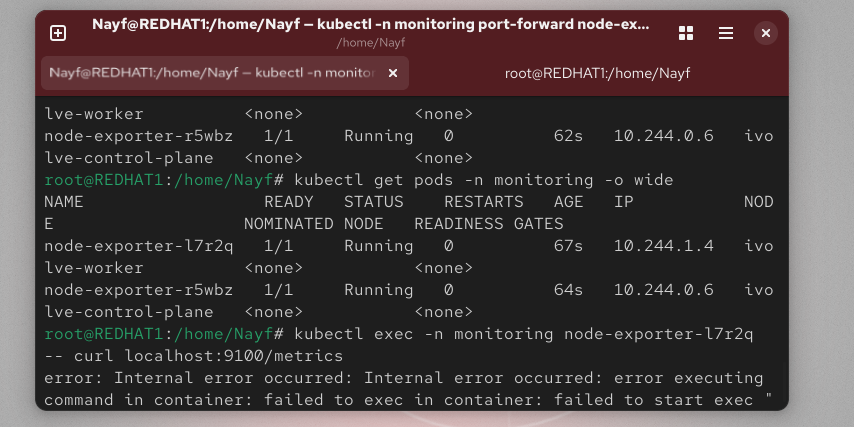

---

# Lab 19: Node-Wide Pod Management with DaemonSet

## الهدف

إعداد **DaemonSet** لتشغيل **Prometheus node-exporter** على كل الـ nodes في الكلاستر ومراقبة الـ metrics الخاصة بالنظام.

---

## الخطوات

### 1. إنشاء Namespace

```bash
kubectl create namespace monitoring
```

---

### 2. إنشاء DaemonSet للـ Node Exporter

```yaml
apiVersion: apps/v1
kind: DaemonSet
metadata:
  name: node-exporter
  namespace: monitoring
  labels:
    app: node-exporter
spec:
  selector:
    matchLabels:
      app: node-exporter
  template:
    metadata:
      labels:
        app: node-exporter
    spec:
      tolerations:
      - operator: "Exists"
      containers:
      - name: node-exporter
        image: prom/node-exporter:latest
        ports:
        - containerPort: 9100
          hostPort: 9100
```

تطبيق DaemonSet:

```bash
kubectl apply -f node-exporter-daemonset.yaml
```

---

### 3. التحقق من تشغيل الـ Pods على كل Node

```bash
kubectl get pods -n monitoring -o wide
```

**النتيجة المتوقعة**:

```
NAME                  READY   STATUS    RESTARTS   AGE   IP           NODE
node-exporter-xxxxx   1/1     Running   0          1m    10.244.x.x   ivolve-worker
node-exporter-xxxxx   1/1     Running   0          1m    10.244.x.x   ivolve-control-plane
```

---

### 4. التحقق من الـ Metrics

بدون الدخول على الـ pod:

```bash
curl http://<NODE-IP>:9100/metrics
```

أو من داخل الـ pod:

```bash
kubectl exec -n monitoring node-exporter-xxxxx -- /bin/sh -c "wget -qO- http://localhost:9100/metrics"
```

**النتيجة المتوقعة**:
ستظهر Metrics مثل:

```
node_xfs_allocation_btree_lookups_total{device="dm-2"} 0
node_xfs_allocation_btree_records_inserted_total{device="dm-0"} 0
...
```

---

### 5. الملاحظات

* DaemonSet يضمن تشغيل الـ node-exporter على كل Nodes بشكل تلقائي.
* استخدمنا `tolerations: - operator: "Exists"` لتجاوز أي Taints موجودة على الـ Nodes.
* البورت 9100 هو البورت الافتراضي للـ node-exporter لعرض Metrics.

