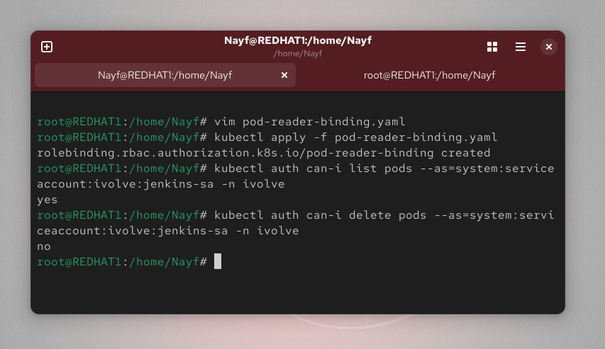

Lab 20: Securing Kubernetes with RBAC and Service Accounts
📌 Objective

Learn how to secure Kubernetes access using RBAC (Role-Based Access Control) by granting a ServiceAccount read-only access to Pods inside a specific namespace.

🧰 Environment

Kubernetes Cluster

kubectl

Namespace: ivolve

🏗 Overview

In this lab, we will:

Create a ServiceAccount named jenkins-sa

Generate a token for authentication

Create a Role that grants read-only access to Pods

Bind the Role to the ServiceAccount using RoleBinding

Validate that the ServiceAccount can only list Pods (not delete them)

🚀 Implementation
1️⃣ Create Namespace
kubectl create namespace ivolve

Verify:

kubectl get ns

2️⃣ Create ServiceAccount
kubectl create serviceaccount jenkins-sa -n ivolve

Verify:

kubectl get serviceaccount jenkins-sa -n ivolve

3️⃣ Create Secret for ServiceAccount Token

Create file jenkins-sa-secret.yaml:

apiVersion: v1
kind: Secret
metadata:
  name: jenkins-sa-token
  namespace: ivolve
  annotations:
    kubernetes.io/service-account.name: jenkins-sa
type: kubernetes.io/service-account-token

Apply the secret:

kubectl apply -f jenkins-sa-secret.yaml

Retrieve the token:

kubectl get secret jenkins-sa-token -n ivolve -o jsonpath='{.data.token}' | base64 --decode

4️⃣ Create Role (pod-reader)

Create file pod-reader-role.yaml:

apiVersion: rbac.authorization.k8s.io/v1
kind: Role
metadata:
  name: pod-reader
  namespace: ivolve
rules:
- apiGroups: [""]
  resources: ["pods"]
  verbs: ["get", "list"]

Apply:

kubectl apply -f pod-reader-role.yaml

5️⃣ Create RoleBinding

Create file pod-reader-binding.yaml:

apiVersion: rbac.authorization.k8s.io/v1
kind: RoleBinding
metadata:
  name: pod-reader-binding
  namespace: ivolve
subjects:
- kind: ServiceAccount
  name: jenkins-sa
  namespace: ivolve
roleRef:
  kind: Role
  name: pod-reader
  apiGroup: rbac.authorization.k8s.io

Apply:

kubectl apply -f pod-reader-binding.yaml

🔍 Validate Permissions
✅ Check allowed action (list pods)
kubectl auth can-i list pods --as=system:serviceaccount:ivolve:jenkins-sa -n ivolve

Expected output:

yes

❌ Check forbidden action (delete pods)
kubectl auth can-i delete pods --as=system:serviceaccount:ivolve:jenkins-sa -n ivolve

Expected output:

no
